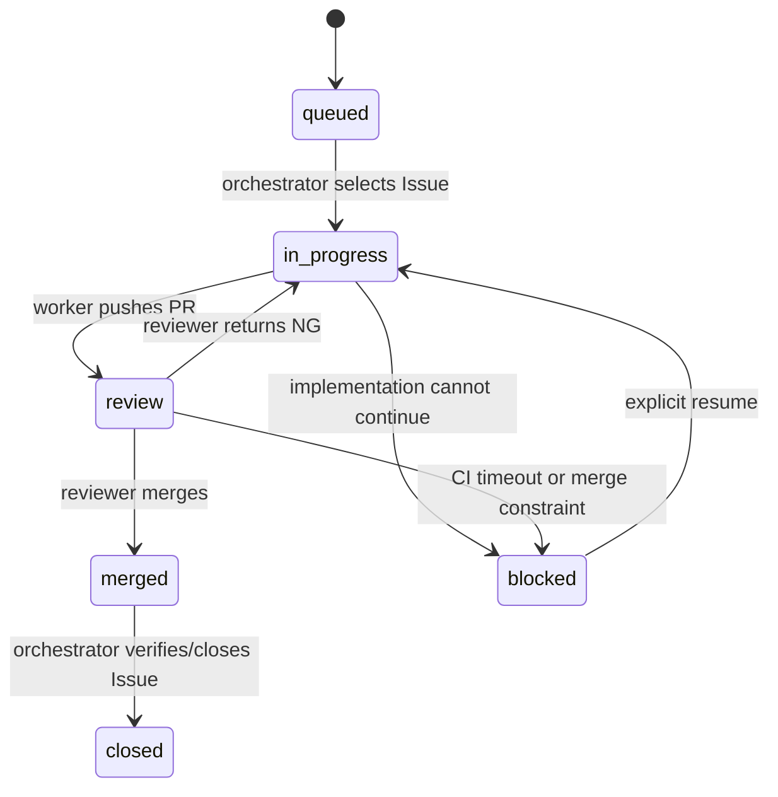

# Autonomous Issue Delivery Protocol

This file is authoritative for orchestration state, role contracts, and cleanup.

## State machine



GitHub labels are the durable source of truth:

- no `status:*` label on an open eligible Issue: queued
- `status:in-progress`: implementing or revising
- `status:review`: awaiting an independent review
- `status:blocked`: automatic progress stopped

Panes and worktrees are ephemeral and must not be used as the durable status store.

## Priority

Order:

1. `priority:critical`
2. `priority:high`
3. `priority:medium`
4. `priority:low`
5. no priority label

Dependencies outrank labels. For equal priority, implement foundations before consumers; use ascending Issue number only as the final tie-breaker.

## Role contracts

### Orchestrator

- Own Issue selection, labels, state transitions, Herdr panes, worktrees, retry count, Issue closure, and cleanup.
- Never own implementation, code review, or PR merge.
- Pass only Issue URL, PR URL, attempt, role skill, and output contract to a child pane.

### Implementer

Returns:

```markdown
- Issue: <URL>
- PR: <URL or なし>
- テスト結果: <commands and pass/fail>
- 残課題: <なし or blocker>
```

### Reviewer

Returns:

```markdown
- 判定: MERGED | NG | BLOCKED
- Issue: <URL>
- PR: <URL>
- 詳細: <minimal reason>
```

## Retry policy

- Create a fresh review pane for every attempt.
- Reuse the worker pane for the first two correction rounds.
- Restart the worker with the strong model before the final correction.
- Stop after three review attempts.
- `NG` on the third attempt becomes durable `status:blocked`.

## Model policy

| Role | Preferred model | Reasoning |
|---|---|---|
| Worker, attempts 1-2 | `gpt-5.6-terra` | `medium` |
| Worker, final correction | `gpt-5.6-sol` | `high` |
| Reviewer | `gpt-5.6-sol` | `high` |

If a preferred model cannot start, retry with the environment default and record:

```markdown
> [!WARNING]
> 指定モデル `<requested>` を利用できなかったため、環境デフォルトへフォールバックしました。
```

Warnings do not change a successful result. Use the same callout for non-fatal CI or cleanup anomalies.

## CI policy

- Poll every 30 seconds.
- Wait at most 15 minutes.
- Failed required check: `NG`.
- Pending after timeout: `BLOCKED`.
- Never bypass required checks, approvals, rulesets, or merge queues.

## Terminal results

Use one of:

```markdown
- 結果: MERGED | NG | BLOCKED | NO_ISSUE
- Issue: <URL or なし>
- PR: <URL or なし>
- テスト結果: <worker result or なし>
- 残課題: <なし or concise detail>
```

Prepend accumulated `WARNING` callouts only when applicable. Do not include raw logs, diff details, review comment bodies, pane transcripts, or internal reasoning.

## Resource retention

| End state | Issue/PR/remote branch | Worktree and owned panes |
|---|---|---|
| `MERGED` | Issue closed, PR merged, remote branch deleted | remove |
| `NG` after limit | Issue/PR/remote branch retained | remove after push |
| `BLOCKED` | Issue/PR/remote branch retained | remove after push |
| cleanup/preservation failure | retain everything needed for recovery | retain only affected resource and warn |

An existing worktree should remain only while actively working, when owned by another run, or when safe preservation/cleanup failed.
