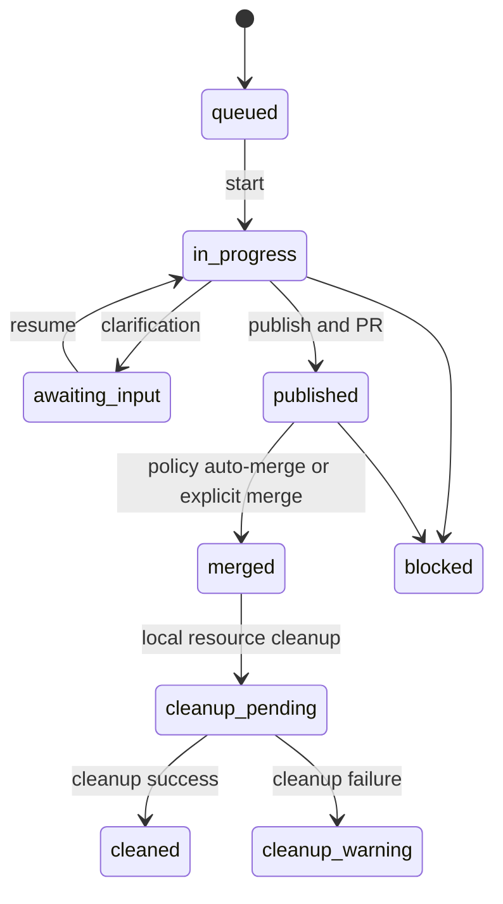

# Autonomous Issue Delivery Protocol

この文書はControllerの配送状態、責務境界、cleanupを定義する。Codexの`$issue-orchestrator`は唯一の自然言語フロントドアであり、インストール済み`issue-controller` console commandへ操作を委譲する。

## 状態モデル

配送状態とcleanup状態は分離する。`merged`はIssue配送の成功であり、cleanup failureは成功を取り消さない。`cleanup_warning`は安全のためresourceを保持したことを示す。

## 責務

| 担当 | 責務 | 禁止事項 |
|---|---|---|
| `$issue-orchestrator` | 自然言語をController commandへ写像し、結果を要約 | Git/GitHub/Herdr/worktree/paneの直接操作、MCP・別APIの追加 |
| Python Controller | state、Git、worktree、pane、検証、commit、publish、merge、cleanup | worker/reviewerの判断を無検証で採用 |
| Implementer | 指定worktreeで実装とテスト | Git/GitHub操作 |
| Reviewer | read-only独立レビュー | 変更、コメント、merge |

フロントドアは状態変更前に`doctor`と`status`を実行する。`issue-controller`が利用できない場合はfail-closedとし、セットアップを案内するだけで自動install/updateしない。

## 操作規約

- 明示Issueの実装依頼は承認を兼ねる。`start --issue <number>`は既定でpublish、PR作成、条件成立時のauto-mergeまで進める。
- dry-runだけが`--no-publish`を使う。`--auto`は「全部」「残り全部」の明示時だけ使う。
- `awaiting_input`では質問を報告して止める。LLMは要件回答を推測・投稿しない。ユーザーが「回答したので続けて」と依頼したときに`resume`する。
- mergeとcleanupは明示語がある時だけ実行する。ただしmerge済みでcleanup pendingを`status`が検知した場合は、追加確認なしでcleanupする。

## Cleanup

merge後のlocal cleanupはControllerが所有を確認して自動で行う。対象はowned pane、clean worktree、local branchなどのlocal resourceだけであり、remote branchは削除しない。cleanupに失敗したresourceは保持し、配送結果を成功のまま`cleanup_warning`として報告する。

## 終了報告

報告にはIssue、phase、PR、テスト、blocker、cleanupだけを含める。raw log、transcript、review本文、内部推論は返さない。
