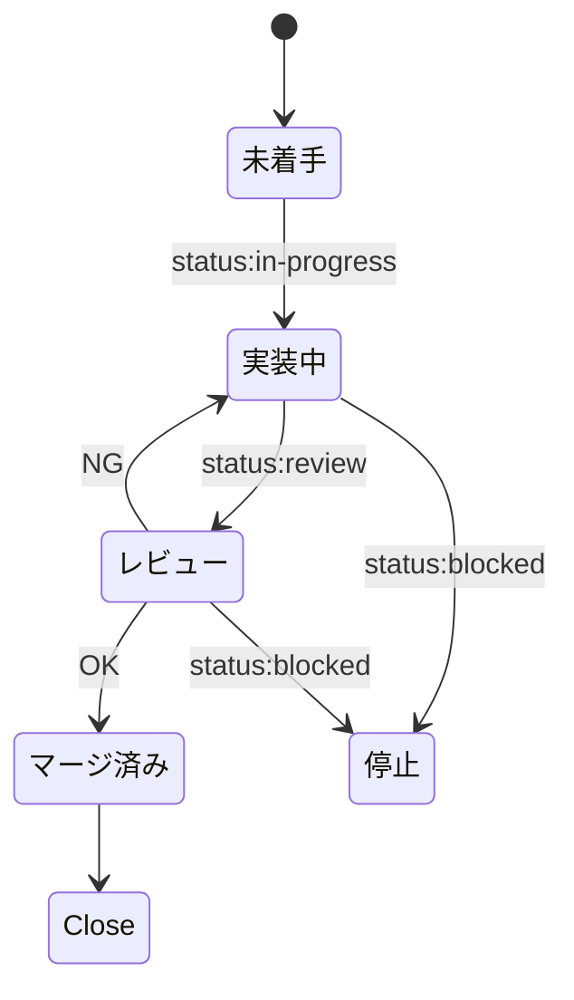

# Autonomous Issue Delivery

GitHub Issue の並列実装は、権限を持つ Python Controller と、低権限の planner / worker / reviewer に分離します。Controller 実装は `tools/issue_controller` にあり、外部コマンドはすべて `shell=False` の引数配列で実行します。worker の出力は JSON データとして検証し、コマンドとしては実行しません。

ローカルでの導入例（Controller 自体は worktree 外の Python 3.12+ 環境から起動します）:

```text
cp config/issue-controller.example.toml config/issue-controller.toml
<venv>/bin/python -m pip install --no-deps --no-build-isolation <repository-path>
<venv>/bin/python -I -m issue_controller --config config/issue-controller.toml doctor
<venv>/bin/python -I -m issue_controller --config config/issue-controller.toml start --auto
```

`<venv>` は Issue worktree 外に作成します。通常の `pip install`（editable install ではない）により Controller package を仮想環境へコピーするため、`-I` でもリポジトリのカレントディレクトリへ依存せずに起動できます。
`--no-build-isolation` を指定する場合、`<venv>` で `setuptools` build backend が利用可能であることが必要です。

`doctor` は `HERDR_ENV=1`、git / gh / herdr / bubblewrap / Docker を必須条件として確認します。bubblewrap と digest 固定 Gitleaks image が利用できない環境では、検証・publish を成功扱いにしません。実GitHubへの push、PR 作成、merge はこのリポジトリのテストでは fake adapter を使用する前提です。

Codex 0.145+ は worker に `-c 'default_permissions=":workspace"'`、reviewer に `-c 'default_permissions=":read-only"'` を使います。旧 `--sandbox` / `--add-dir` は混在させません。読み込まれる既知の Codex config layer に `sandbox_mode` または `sandbox_workspace_write` があれば、profile が無効化され得るため agent 起動前に fail-closed で停止します。

実装の状態、ログ、lock はリポジトリ外の `<repository-parent>/.herdr-issue-controller/<repository-name>/` に保存します。未確認の dirty worktree や所有不明の Docker container は自動削除しません。

## Webアプリケーション開発環境

リポジトリ直下に、次の構成でWebアプリケーション開発環境を構築します。

- Node.js 24 LTS、pnpm 11
- Next.js 16.2.9、TypeScript 5.1以上、App Router、ESLint
- アプリケーションコードは `src/app` に配置し、インポートエイリアスは `@/*` を使用
- Tailwind CSS 4.3とPostCSSを使用
- Vitest 4.1.6、React Testing Library、jsdomによるコンポーネントテスト
- Pull Requestと `main` へのpushでlint、test、buildを実行するGitHub Actions

Tailwind CSS 4.3の対象ブラウザはChrome 111以上、Safari 16.4以上、Firefox 128以上とします。エンドユーザー向け機能、認証、データ保存、デプロイ、E2Eテスト、非同期Server Componentの単体テスト、旧ブラウザ対応は初期構築の対象外です。

## 起動

通常の入口は Controller の `start` です。Controller が worktree、pane、検証、commit、publish を管理します。

```text
<venv>/bin/python -I -m issue_controller --config config/issue-controller.toml start --auto
```

Issue を明示する場合:

```text
<venv>/bin/python -I -m issue_controller --config config/issue-controller.toml start --issue 123
```

`$issue-orchestrator` は Controller の実行案内と read-only の `doctor` / `status` 確認だけを担当します。`start`、`publish`、`merge`、`cleanup` は実行しません。

## Skill

| Skill | 責務 |
|---|---|
| `issue-orchestrator` | Controller の利用案内と read-only 状態確認のみ |
| `issue-planner` / planner | 計画 JSON の提案のみ。Controller・Git・GitHubを操作しない |
| `issue-implementer` | 指定 worktree の実装とテスト、固定 JSON 結果の返却のみ |
| `issue-reviewer` | read-only の独立レビューと固定 JSON 結果の返却のみ |
| `issue-controller` | state machine、Git/worktree/pane、検証、commit、許可済み publish / merge gate |
| `issue-requirements-interviewer` | 要件を1問ずつ整理し、合意済みの実装単位をIssue化 |

## 要件ヒアリング

新機能や計画を対話で整理してIssue化する場合は、次を使用します。Skillは既存のドメイン文書・コード・Issueを調査し、質問を1回に1つだけ行います。確定した実装単位からIssue化しますが、実装は開始しません。

```text
$issue-requirements-interviewer
```

## 優先度と状態

優先度は `priority:critical` → `priority:high` → `priority:medium` → `priority:low` → ラベルなしの順です。依存関係は優先度より先に解決します。

状態の正本はGitHub Issueラベルです。



同時実行は1リポジトリにつき1指示役を前提とします。作業・レビューペインとworktreeは完了後に削除し、安全に保全できない変更や外部所有のリソースは削除しません。
