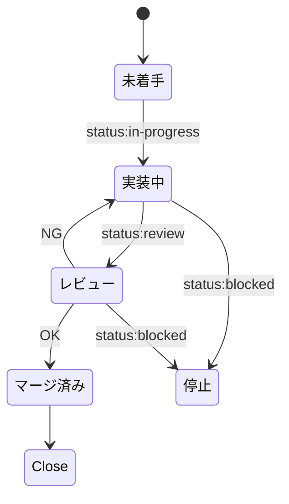

# Autonomous Issue Delivery

GitHub Issueを優先度・依存関係順に1件選び、実装、PRレビュー、squash merge、Issue Close、後片付けまで自律実行する3 Skill構成です。

## 起動

```text
$issue-orchestrator
```

Issueを指定して再開する場合:

```text
$issue-orchestrator 123
```

## Skill

| Skill | 責務 |
|---|---|
| `issue-orchestrator` | Issue選定、状態管理、Herdrペイン/worktree、再試行、Close、cleanup |
| `issue-implementer` | 実装、テスト、commit/push、PR作成・修正 |
| `issue-reviewer` | Issue/PRレビュー、inlineコメント、CI確認、squash merge |
| `issue-requirements-interviewer` | 要件を1問ずつ整理し、合意済みの実装単位をIssue化 |

## 要件ヒアリング

新機能や計画を対話で整理してIssue化する場合は、次を使用します。Skillは既存のドメイン文書・コード・Issueを調査し、質問を1回に1つだけ行います。確定した実装単位からIssue化しますが、実装は開始しません。

```text
$issue-requirements-interviewer
```

## 優先度と状態

優先度は `priority:critical` → `priority:high` → `priority:medium` → `priority:low` → ラベルなしの順です。依存関係は優先度より先に解決します。

状態の正本はGitHub Issueラベルです。



同時実行は1リポジトリにつき1指示役を前提とします。作業・レビューペインとworktreeは完了後に削除し、安全に保全できない変更や外部所有のリソースは削除しません。
